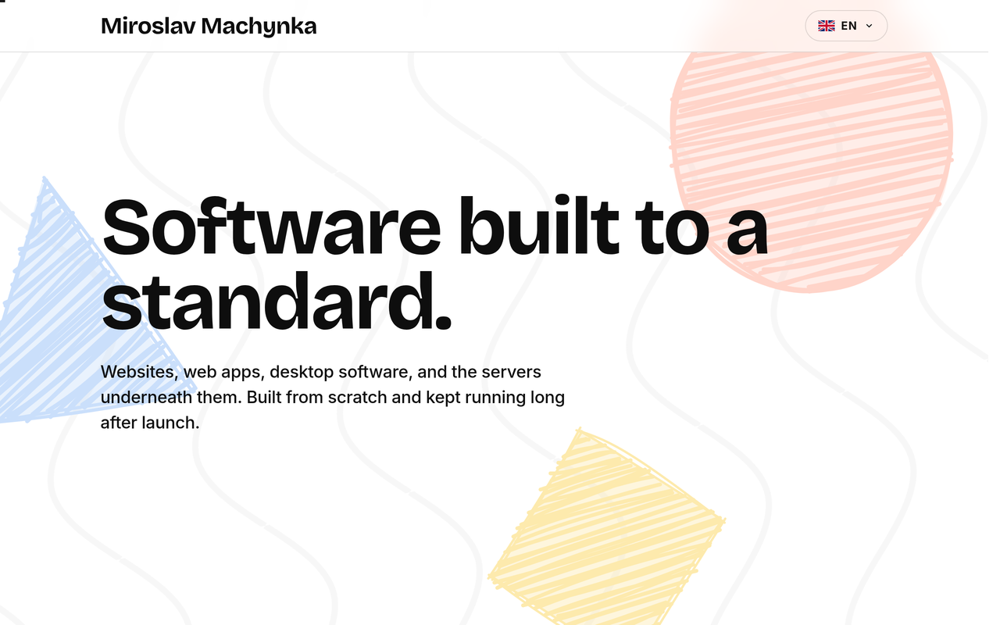
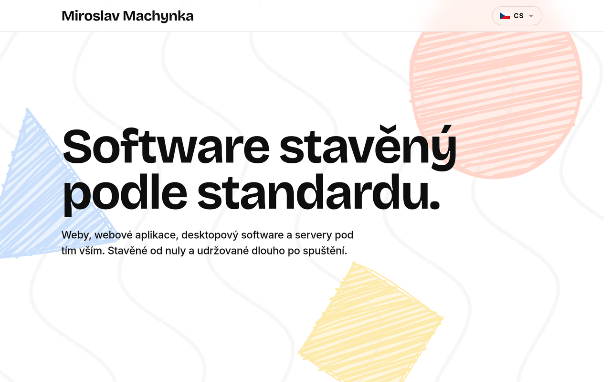
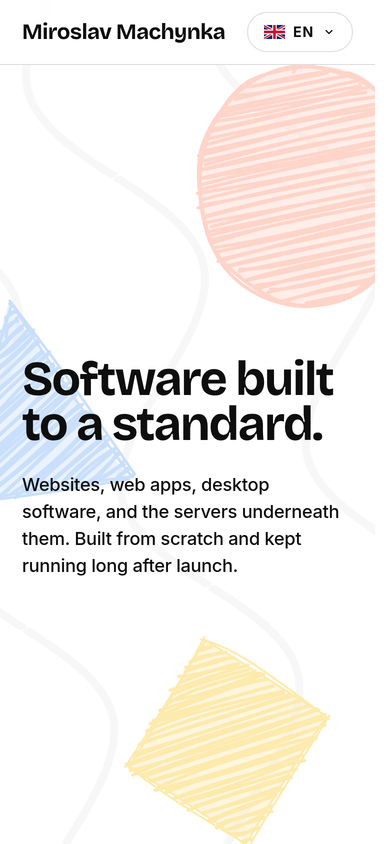

<div align="center">


**The personal site of Miroslav Machynka: a bilingual, prerendered portfolio covering the work he takes on, how he builds, and a direct contact address.**

[](LICENSE)
[](#install)
[](#runtime)

</div>

---

This repository owns what is specific to this one site: the copy and its Czech and English translations, the composition of the five sections, the hand-drawn shapes, the brand mark, and the design values in `.trebired/`. The `@trebired/*` packages own everything generic, listed under [Concepts](#trebired-package-ownership): the build, the browser runtime, locale routing, the UI primitives, translation lookup, SEO artifacts, and logging. The operator owns the static host and the DNS record. This repository does not own a server, a database, or any behaviour that is not specific to this site.

The output is static files. There is no backend, no database, no accounts, and no analytics, and the site issues no requests on a visitor's behalf. The only thing a visitor can send is an email they compose in their own mail client.

mirmachynka.com is a Trebired product, licensed under the MIT License. See [LICENSE](LICENSE).

## Contents

- [Install](#install)
- [Quick Start](#quick-start)
- [Screens](#screens)
- [Concepts](#concepts)
- [Configuration](#configuration)
- [Runtime](#runtime)
- [Contributing](#contributing)
- [What It Does Not Do](#what-it-does-not-do)

## Install

Runtime support: Bun 1+.

```sh
bun i
```

## Quick Start

```sh
bun run dev
```

The dev server runs behind the Code Discipline gate, builds the client into `dist`, watches `src/frontend`, and serves on port 3000. `bun run dev:app` skips the gate. `bun run build` writes the production client and the prerendered documents into `dist`, which is the directory to deploy.

## Screens

English at `/` and Czech at `/cs`, each served as its own prerendered document:

| | |
| --- | --- |
|  |  |

<div align="center">



</div>

## Concepts

### One page per locale, prerendered, then hydrated

There is no backend and no client router. `src/frontend/pages/home.tsx` composes five sections: the opening statement, the work list, the about text, the working principles, and contact. At build time `src/frontend/ssr/entry.tsx` renders the header, the page body, and the footer to HTML once per locale, and `@trebired/bundler` writes each into its own static document with its own head tags. In the browser the header and footer hydrate as their own roots and the page body hydrates as a live island.

### Locale-prefixed routing

English is served at `/` and Czech at `/cs`, each a separate prerendered document with its own `<html lang>`, title, description, canonical URL, and `hreflang` set. `@trebired/frontend` owns the mechanism: a boot script in the head resolves the visitor's locale from storage or the browser and redirects before first paint, and `LocaleProvider` supplies the same locale to the server render and to hydration so the two agree. The language is never corrected after the page is visible, and both locales are separately indexable.

### Trebired package ownership

Generic behaviour belongs to the packages, not to this repository:

- `@trebired/frontend` owns the layout primitives, text links, icons, flags, popover, progress bar, design tokens, favicon generation, locale routing, and the browser runtime.
- `@trebired/bundler` owns the client build, SCSS compilation, asset manifest, static document generation, and the Bun static asset handler.
- `@trebired/seo` owns canonical URLs, `hreflang` alternates, Open Graph and Twitter tags, JSON-LD, `robots.txt`, and `sitemap.xml`.
- `@trebired/i18n` owns translation lookup and the colocated translator transform.
- `@trebired/logger` owns everything `src/bin` prints.
- `@trebired/startup` owns dev server lifecycle, shutdown, and the port requirement.
- `@trebired/utils` owns the organization and product identity readers used at build time.
- `@trebired/code-discipline` owns formatting, size limits, comment removal, and alias-managed imports.

Application code supplies copy, section structure, and design values.

### Colocated translations

Every component that renders text calls `createLocalTranslator(import.meta.url, language)` and keeps `i18n/en.ts` and `i18n/cs.ts` beside itself. The bundler rewrites those calls into static imports at build time and fails the build when the two language files disagree on keys.

### Colocated styles

Every stylesheet is a `styles.scss` next to the component it styles. The bundler collects global styles by filename pattern, not by import: `css/**/*.scss`, `components/**/styles.scss`, `components/**/styles/**/*.scss`, and the same three under `js/`. A stylesheet outside those patterns, such as `pages/styles.scss`, is silently dropped from the bundle with no error. Page level rules therefore live in `components/chrome/page/styles.scss`.

### Hand-drawn shapes

`components/domain/shapes` places fixed pastel circles, squares, and triangles behind the page, one set per section. Every shape is generated with Rough.js from a seed declared in `src/frontend/shared/shapes.ts`, so each is drawn its own way and the output is identical on the server and in the browser. Seeding is what makes them safe to prerender.

### The brand mark

`src/brand/favicon.svg` is the only icon source: a lowercase `mm` in Bricolage Grotesque over a hand-drawn hatched square. `@trebired/frontend` rasterizes it at build time into `favicon.ico`, `apple-touch-icon.png`, and the PNG sizes, and emits the head links. Nothing generated is written back into the repository.

## Configuration

Package behaviour is configured under `.trebired/`:

| File | Owns |
| --- | --- |
| `.trebired/frontend/config.ts` | Palette, theme mode, scales, button tones, fonts, flags, favicon source, static icon specs, enabled systems |
| `.trebired/bundler/config.ts` | Frontend directory, output layout, public path |
| `.trebired/seo/config.ts` | Site URL, locales, locale strategy, robots policy, sitemap defaults |
| `.trebired/i18n/config.ts` | Supported languages, fallback language, checker root |
| `.trebired/startup/config.ts` | Dev server port requirement and shutdown timeout |
| `.trebired/code-discipline/config.ts` | Preset, banned patterns, process boundary files |

The site is light only: `.trebired/frontend/theme.ts` declares a single `light` mode and the palette maps every semantic token to it. Product and organization identity live in `package.json#config`, are injected as build-time defines, and are re-exported from `src/frontend/shared/identity.ts`. The contact address is derived from the product domain and is never written as a literal.

Editing a file that `.trebired/frontend/config.ts` imports through a `#` alias, such as `src/frontend/icon_specs.ts`, does not invalidate the compiled config cache. Clear `node_modules/.cache/frontend` when a config change does not take effect.

## Runtime

The build emits an ES module client bundle, two stylesheets, the self hosted font files, the rasterized favicon set, `robots.txt`, `sitemap.xml`, and one prerendered HTML document per locale. Deploy `dist` to any static host that resolves a directory to its `index.html`.

Icons resolve from a build-generated static cache, so the page makes no icon requests. The chosen locale is stored in `localStorage` and applied by redirecting to that locale's URL before first paint. A page load progress bar is booted from the client entry and driven by `@trebired/frontend`.

## Contributing

See [CONTRIBUTING.md](CONTRIBUTING.md).

## What It Does Not Do

This application does not:

- Run a server, a database, or any scheduled work. Every document is prerendered at build time.
- Collect anything. There is no contact form; the contact address is a `mailto:` link.
- Set analytics, advertising, or tracking cookies.
- Ship a test suite. Verification is `code-discipline check`, `tsc --noEmit`, and a real build.
- Restyle `@trebired/frontend` components from application CSS. Appearance changes go through `.trebired/frontend/config.ts`.
- Serve routes beyond the single page in each locale, or offer a dark theme.
